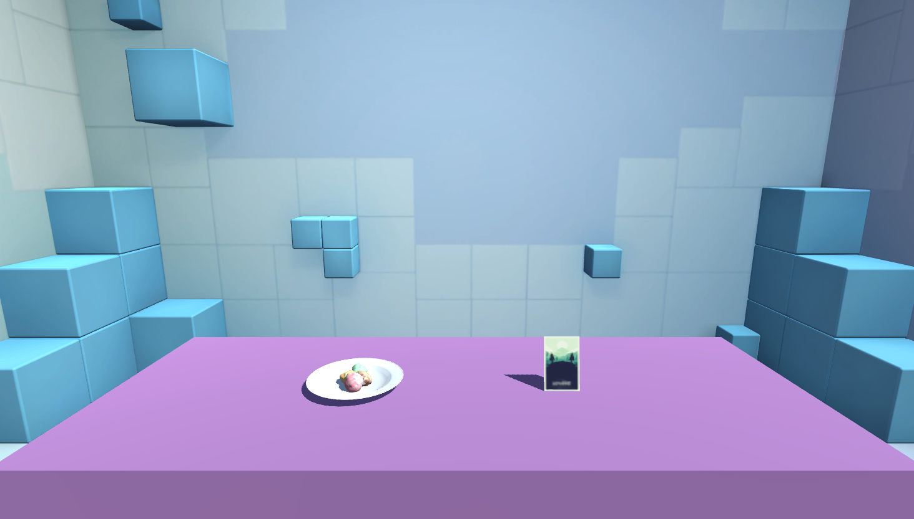

# Paired associates VR

Begin the task like any UXF task. Settings can be modified by changing values in `/StreamingAssets/

* Session 1: Encode pairs just by looking at them as they are shown infront of the participant.
* Session 2+: Recall pairings by using the Oculus Touch controller to touch the object that creates the valid pair.

Requires an Oculus headset on Windows.

Note: Built in Unity 2018.3.

